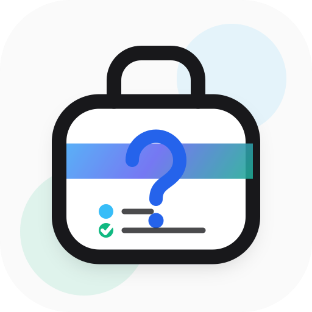

# Personal Hub

<p align="center">
  
</p>

A **local-first** personal toolkit for learning and career work. Capture project questions, content ideas, weekly tasks, daily logs, and your job search — all stored in your browser. Nothing is sent to a server.

Installable as a Progressive Web App (PWA) and usable offline after the app shell has been cached.

**Live:** [hub.lakshaymahajan.com](https://hub.lakshaymahajan.com) · **Source:** [github.com/lakshay2425/personal-hub](https://github.com/lakshay2425/personal-hub)

## Features

| Tool | What it does |
|------|----------------|
| **Projects** | Inbox for questions; organize them into projects with titled answers. Sub-question hierarchy (up to 3 levels), drag-and-drop reorder, move between projects/inbox. JSON export/import. |
| **Content Ideas** | Capture ideas standalone or per-project; sub-ideas (up to 3 levels), status (Draft / Ready / Published), publish links, list/table/card views. Drag-and-drop, reparent, activity log. **Content Calendar** to schedule publish dates (month/week views). Included in Projects export. |
| **Planner** | Monday-based weekly task planner with week navigation, priority badges (High / Medium / Low), optional notes with voice input, and backlog for past incomplete tasks. Completing a task auto-creates a separate Logger entry for today. Tasks included in Projects JSON export. |
| **Logger** | Timestamped daily entries — log multiple times per day. Dashboard view to filter and review entries by date. Future dates blocked on add/edit. JSON export/import. |
| **Job Search Tracker** | Companies, leads, outreach (LinkedIn/X), applications, cold emails, and **outreach templates**. Create reusable templates (cold email, LinkedIn, X DM, follow-up) with copy-to-clipboard and `{{name}}` / `{{company}}` / `{{role}}` placeholders. **Link templates** to cold emails, outreach leads, and email follow-ups so you know which message was used. Global search, voice-to-text on forms, company detail pages, lead channels (Email / LinkedIn / X / Other) with conditional follow-up dates. JSON export/import (v4). |

Shared across tools: light/dark theme (system default, persisted in localStorage), toast notifications, and responsive sidebar layout.

All feature data lives in **IndexedDB** (via [Dexie](https://dexie.org)). Three databases: projects, content ideas, and planner tasks share one; logger and job search each have their own. See [DATA.md](DATA.md) for schemas, migrations, and export formats.

## Routes

| Route | Description |
|-------|-------------|
| `/` | Landing page |
| `/projects` | Project list + question inbox |
| `/projects/[projectId]` | Project detail — Questions and Content Ideas tabs |
| `/content-ideas` | Standalone content ideas (not tied to a project) |
| `/content-ideas/calendar` | Content calendar — schedule ideas by date (planning only, no auto-posting) |
| `/planner` | Weekly task planner — week navigation, backlog, Logger integration on complete |
| `/logger` | Log entries (chronological) |
| `/logger/dashboard` | Filter and review entries by date |
| `/job-search` | Dashboard — stats, recent activity, follow-ups |
| `/job-search/companies` | Company list |
| `/job-search/companies/[id]` | Company detail |
| `/job-search/leads` | Email and other leads — follow-up dates and follow-up template links (Email channel) |
| `/job-search/outreach` | LinkedIn and X outreach leads — outreach and follow-up template links |
| `/job-search/applications` | Applications |
| `/job-search/cold-emails` | Cold emails — outreach and follow-up template links |
| `/job-search/templates` | Outreach message library (cold email, LinkedIn, X DM, follow-up) |

Legacy redirect: `/questions` → `/projects`.

## Tech stack

| Area | Details |
|------|---------|
| **Framework** | [Next.js 16](https://nextjs.org) (App Router) + [React 19](https://react.dev) |
| **Language** | TypeScript (strict) |
| **Styling** | [Tailwind CSS v4](https://tailwindcss.com) |
| **Local storage** | IndexedDB via [Dexie](https://dexie.org) |
| **Drag-and-drop** | [@dnd-kit](https://dndkit.com) |
| **Forms / validation** | [react-hook-form](https://react-hook-form.com) + [Zod](https://zod.dev) |
| **PWA / offline** | [Serwist](https://serwist.pages.dev) (`@serwist/turbopack`) |
| **Notifications** | [react-hot-toast](https://react-hot-toast.com) |
| **Git hooks** | [Husky](https://typicode.github.io/husky/) — lint on commit, build on push |
| **CI** | GitHub Actions — lint + build on PRs / pushes to `master` |
| **Containerization** | Multi-stage Dockerfile with Next.js `output: "standalone"` |

- **Runtime:** Node.js 24  
- **Package manager:** [pnpm](https://pnpm.io) 10.x  

## Getting started

```bash
pnpm install
pnpm dev
```

Open [http://localhost:3000](http://localhost:3000).

> Service worker registration is disabled in development to avoid stale caches. Test install / offline behavior with a production build (`pnpm build` then `pnpm start`). HTTPS (or `localhost`) is required for PWA features.

## Available scripts

| Script | Description |
|--------|-------------|
| `pnpm dev` | Start development server |
| `pnpm build` | Production build |
| `pnpm start` | Start production server |
| `pnpm lint` | Run ESLint |

## Project structure

```
app/                       # App Router pages, layouts, PWA glue
├── page.tsx               # Landing
├── projects/              # Projects + inbox UI (content ideas per project)
├── content-ideas/         # Standalone content ideas + calendar
├── planner/               # Weekly task planner
├── logger/                # Daily logger + dashboard
├── job-search/            # Job search tracker routes
├── providers/             # Theme + Serwist providers
├── manifest.ts            # Web app manifest
├── robots.ts              # Crawler rules
├── sitemap.ts             # Public route sitemap
├── sw.ts                  # Service worker (runtime cache + offline fallback)
├── serwist/[path]/        # Serves /serwist/sw.js
└── ~offline/              # Offline navigation fallback
components/                # App shell, sidebar, shared UI (export/import buttons)
features/
├── questions/             # Projects / questions / answers (Dexie)
├── content-ideas/         # Content ideas UI + repo (shared question-hub-db)
├── planner/               # Weekly task planner (shared question-hub-db)
├── logger/                # Log entries (Dexie)
└── job-search/            # Companies, leads, applications, cold emails, templates (Dexie v4)
lib/
├── site.ts                # Site name, description, keywords, URLs
└── export/                # Shared JSON download / validation helpers
public/
├── icons/                 # Install / maskable / Apple touch icons
├── llms.txt               # AI/crawler context (see /llms.txt in production)
├── logo.png               # App logo
└── opengraph-image.png    # Open Graph image
scripts/generate-icons.mjs # PWA icon generation
```

## Privacy & data

- Data never leaves the device for storage or sync.
- Clearing site data / IndexedDB in the browser deletes your local records.
- There is no background sync and no centralized database for user content.
- The only server routes are app infrastructure (e.g. health check for Docker).
- For IndexedDB schemas, field types, and export formats, see [DATA.md](DATA.md).

## PWA overview

1. **HTTPS** — required for service workers (`localhost` is fine for local testing).
2. **Web app manifest** — [`app/manifest.ts`](app/manifest.ts) with `display: "standalone"` and icons under [`public/icons/`](public/icons/).
3. **Service worker** — Serwist builds and serves `/serwist/sw.js` from [`app/serwist/[path]/route.ts`](app/serwist/[path]/route.ts) + [`app/sw.ts`](app/sw.ts).

The service worker caches the app shell and static assets so the UI can load offline. It does **not** sync IndexedDB data anywhere.

### Offline behavior

- Visit key routes once while online so runtime caching can store them.
- After that, reloads and navigation between previously visited routes work offline.
- Uncached navigations fall back to [`app/~offline/page.tsx`](app/~offline/page.tsx).
- IndexedDB create / edit / delete continues to work offline once the JS shell is available.

### Architecture notes

**Runtime caching** (Serwist `defaultCache`) plus a small precache entry for `/~offline`, instead of full precaching of every hashed Next.js asset. Low install cost; routes become offline after first visit. A true cold start offline only guarantees the `/~offline` fallback.

**Per-build `randomUUID()`** for the offline fallback revision (instead of `git rev-parse HEAD`) so Docker Alpine builds do not need `git` installed. Each deploy still cache-busts that entry.

## Docker

```bash
docker build -t personal-hub .
docker run -p 3000:3000 personal-hub
```

The image includes a health check against `/api/health`. Serve behind HTTPS in production so install prompts and the service worker work on real devices.

## Contributing

Contributions are welcome — bug reports, docs, and pull requests. See [CONTRIBUTING.md](CONTRIBUTING.md) for setup, guidelines, and the PR process.

## License

This project is licensed under the [MIT License](LICENSE.txt).
